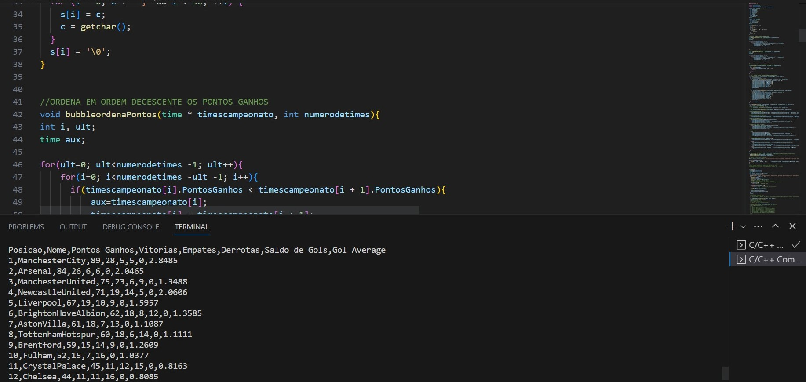
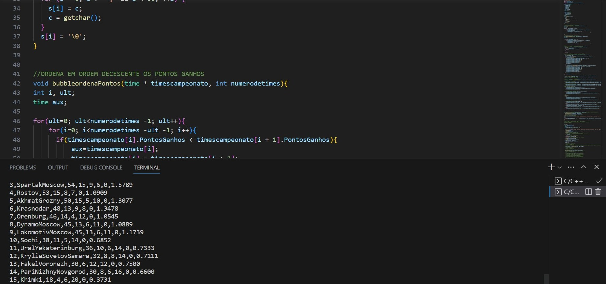

# Segundo-Programa-em-C

Estou no primeiro ano da faculdade de Sistemas de Informação na USP e esse foi meu segundo trabalho para disciplina de Introdução a Programação.
Eu disponibilizei o enunciado do exercício para ser possível testar seus conhecimentos em C e fazer o programa, após a execução do programa ele salva os resultados em um arquivo.
Basicamente nesse trabalho vários times seriam inseridos e deveria ter a criação de uma tabela com os tipos organizados em ordem decrescente pelos Pontos Ganhos e caso ocorresse empate seria feito pelo Saldo de Gols.
Segue a lógica de campeonatos onde a vitória garante 3 pontos, derrota 0 pontos e empate 1 ponto.

Há muitas entradas disponíveis para teste e eu disponibilizeis elas em um arquivo compactado.
Aqui o arquivo do enunciado:
[Link para o PDF QUE CONTÉM O ENUNCIADO do EP2](ep2%20ENUNCIADO.pdf)

Mostrei dois exemplos de saída o primeiro teste foi com a Liga Premier e o segundo teste é com a Liga Russa.

Liga Premier

Liga Russa

